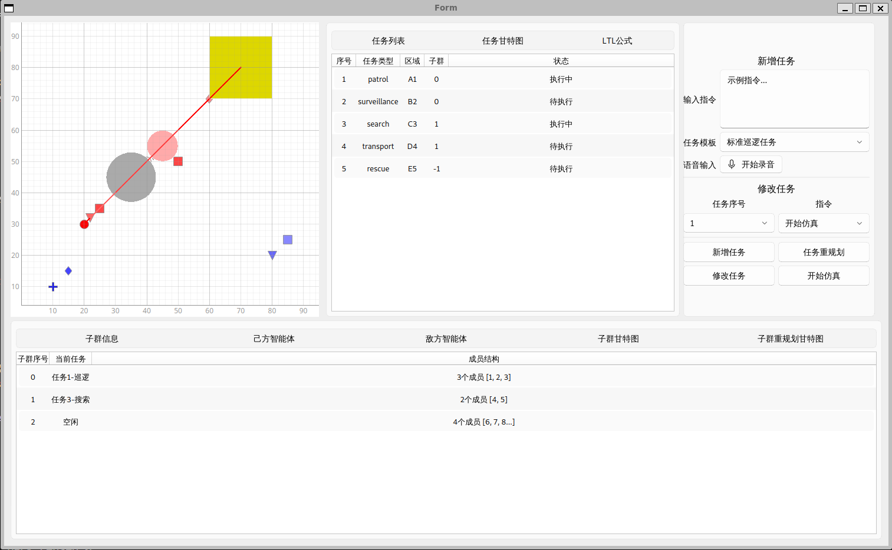

# 机器人GUI系统

一个基于PyQt5的机器人任务管理和仿真可视化系统，采用分层架构设计，支持灵活的后端适配。



## 项目概述

本项目提供了一个完整的GUI界面，用于：
- 管理和监控机器人任务
- 可视化智能体（无人机）状态和子群信息
- 实时显示仿真场景
- 发送控制命令到后端系统

## 项目结构

```
GUI/
├── home_interface.py          # 主界面入口，整合所有面板
├── task_panel.py              # 任务信息面板
├── agent_panel.py             # 智能体信息面板
├── command_interface.py       # 命令输入界面
├── example_backend_adapter.py # 示例后端适配器（用于测试）
├── services/                  # 服务层（数据转换和业务逻辑）
│   ├── backend_adapter.py    # 后端适配器抽象基类
│   ├── agent_service.py      # 智能体服务
│   ├── task_service.py       # 任务服务
│   ├── command_service.py    # 命令服务
│   └── simulation_service.py # 仿真服务
├── components/                # 可复用UI组件
│   ├── generic_simul_canvas.py    # 仿真画布组件
│   ├── generic_tablewidget.py     # 通用表格组件
│   ├── generic_ganntwidget.py     # 通用甘特图组件
│   ├── generic_plotcanvas.py     # 通用绘图画布
│   ├── selectorchartwidget.py     # 选择器图表组件
│   ├── navi_panel.py              # 导航面板组件
│   └── matplotlib_font_config.py  # matplotlib中文字体配置
└── ui/                        # UI设计文件（Qt Designer生成）
    ├── UI_HomeInterface.py
    └── UI_CommandInterface.py
```

## 快速开始

### 环境要求

- Python 3.7+
- PyQt5
- qfluentwidgets
- pyqtgraph
- matplotlib

### 安装依赖

```bash
pip install PyQt5 qfluentwidgets pyqtgraph matplotlib
```

### 运行程序

```bash
python home_interface.py
```

## 主要功能模块

### 1. 主界面 (`home_interface.py`)

主界面整合了所有功能面板，包括：
- **任务信息面板**：显示任务列表、甘特图和LTL公式
- **智能体信息面板**：显示子群信息、无人机信息和甘特图
- **仿真画布**：实时显示仿真场景中的智能体、目标和区域
- **命令面板**：输入和发送控制命令

**使用方法：**
```python
from home_interface import HomeInterface
from example_backend_adapter import ExampleBackendAdapter

# 创建后端适配器
backend = ExampleBackendAdapter()

# 创建主界面（依赖注入）
home_interface = HomeInterface(backend=backend)
home_interface.show()
```

### 2. 服务层 (`services/`)

服务层负责数据格式转换和业务逻辑处理，将后端数据转换为GUI需要的格式。

**核心组件：**
- `BackendAdapter`：后端适配器抽象基类，定义统一的后端接口
- `AgentService`：处理智能体相关数据转换
- `TaskService`：处理任务相关数据转换
- `CommandService`：处理命令解析和发送
- `SimulationService`：处理仿真场景数据转换

**扩展后端：**
要实现自定义后端，只需继承`BackendAdapter`并实现所有抽象方法。参考`example_backend_adapter.py`。

### 3. UI组件 (`components/`)

提供可复用的UI组件，包括：
- **表格组件**：用于显示结构化数据
- **甘特图组件**：用于显示时间线任务
- **仿真画布**：用于2D场景可视化
- **导航面板**：用于多页面切换

### 4. 示例后端适配器 (`example_backend_adapter.py`)

提供模拟数据用于开发和测试，展示了如何实现`BackendAdapter`接口。

## 架构设计

### 分层架构

1. **UI层**：负责界面展示和用户交互
2. **服务层**：负责数据格式转换和业务逻辑
3. **适配器层**：负责与后端系统通信

### 依赖注入

系统采用依赖注入模式，通过构造函数注入后端适配器，使得系统可以灵活切换不同的后端实现。

### 数据流

```
后端系统 → BackendAdapter → Service层 → UI组件
```

## 使用指南

### 1. 使用示例后端

直接运行`home_interface.py`即可使用示例后端，查看模拟数据。

### 2. 连接真实后端

1. 创建自定义后端适配器类，继承`BackendAdapter`
2. 实现所有抽象方法（`fetch_agent_data`、`fetch_task_data`等）
3. 在创建`HomeInterface`时传入自定义适配器实例

```python
from home_interface import HomeInterface
from your_backend import YourBackendAdapter

backend = YourBackendAdapter()
home_interface = HomeInterface(backend=backend)
```

### 3. 数据刷新机制

- 系统每1秒自动刷新一次数据
- 仿真时间每100ms更新一次（当仿真运行时）
- 可通过`refresh_all_data()`方法手动刷新

### 4. 发送命令

通过命令面板输入指令，系统会自动解析并发送到后端。支持的命令类型包括：
- 开始/停止仿真
- 更新任务
- 删除任务
- 自定义指令

## 详细文档

- [服务层详细说明](services/README.md)
- [组件库详细说明](components/README.md)
- [UI设计文件说明](ui/README.md)

## 开发说明

### 代码规范

- 使用类型提示（typing）
- 遵循PEP 8代码风格
- 使用中文注释和文档字符串

### 扩展指南

1. **添加新的UI组件**：在`components/`目录下创建新组件
2. **添加新的服务**：在`services/`目录下创建新服务类
3. **修改UI布局**：使用Qt Designer编辑`.ui`文件，然后重新生成Python代码

## 许可证

MIT License

Copyright (c) 2025 Luo Yinhang

## 联系方式

[yinhang.luo@pku.edu.cn]

